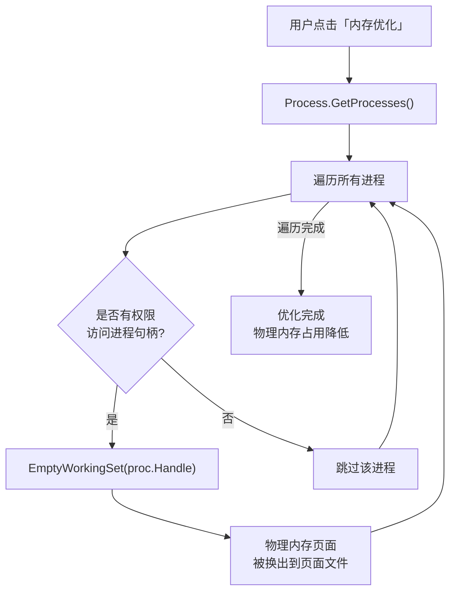

+++
date = '2026-09-07T12:00:00+08:00'
draft = false
title = 'PCL2百宝箱内存优化功能分析'
tags = ["内存优化"]
categories = ["随笔"]
+++
# PCL2 百宝箱 — 内存优化功能实现分析
本文借助了Claude Opus4.6

## 概述

PCL2（Plain Craft Launcher 2）百宝箱中的**内存优化**功能本质上是通过调用 **Windows API** 来强制缩减系统中各进程的物理内存占用（工作集），从而为 Minecraft 的 JVM 腾出更多可用的物理内存。

> [!NOTE]
> PCL2 官方开源仓库中，百宝箱相关代码被故意隐去，源码中仅有占位提示：
> `Hint("为便于维护，开源内容中不包含百宝箱功能……")`
> 
> 以下分析基于社区版 (PCL2-CE) 的公开讨论、GitHub Issues，以及对技术原理的逆向推断。

---

## 核心实现原理

### 1. 调用 Windows API — `EmptyWorkingSet`

内存优化的核心是调用 `psapi.dll`（或 `kernel32.dll`）中的 **`EmptyWorkingSet`** 函数：

```vbnet
Imports System.Runtime.InteropServices

' 声明 Windows API
<DllImport("psapi.dll", SetLastError:=True)>
Private Shared Function EmptyWorkingSet(ByVal hProcess As IntPtr) As Boolean
End Function
```

**`EmptyWorkingSet` 的作用**：强制将目标进程的**工作集**（Working Set，即当前占用的物理内存页面）尽可能换出到**页面文件**（虚拟内存/Swap），从而在系统层面"释放"物理内存。

### 2. 遍历系统所有进程

PCL2 使用 .NET 的 `Process.GetProcesses()` 获取当前系统中运行的所有进程，然后逐一对其调用 `EmptyWorkingSet`：

```vbnet
' 伪代码 — 基于公开信息推断的大致逻辑
Public Shared Sub OptimizeMemory()
    For Each proc As Process In Process.GetProcesses()
        Try
            EmptyWorkingSet(proc.Handle)
        Catch ex As Exception
            ' 跳过权限不足的进程（如系统进程）
        End Try
    Next
End Sub
```

**关键步骤**：
1. **枚举进程** — 通过 `Process.GetProcesses()` 获取所有运行中的进程
2. **逐一清理** — 对每个进程调用 `EmptyWorkingSet(proc.Handle)`
3. **异常处理** — 对于系统关键进程（权限不足无法操作的），捕获异常并跳过
4. **异步执行** — 整个清理过程在后台线程中执行，避免阻塞 UI 线程

### 3. 命令行静默模式

PCL2 还支持通过启动参数 `--memory` 以静默方式执行内存优化：

```
PCL.exe --memory
```

这会启动 PCL2，执行内存清理逻辑后自动退出，适合集成到脚本或快捷方式中。

---

## 技术原理图



---

## 效果与局限性

### ✅ 能做到什么
| 效果 | 说明 |
|------|------|
| 降低物理内存占用 | 任务管理器中显示的内存使用量会立即下降（通常可降低约 1/3） |
| 为游戏腾出空间 | 在启动 Minecraft 前释放物理内存，使 JVM 能分配到更多连续内存 |
| 低内存设备受益 | 对 8GB 及以下内存的电脑效果较明显 |

### ⚠️ 局限性与注意事项

> [!WARNING]
> **这不是真正的内存释放！**  
> `EmptyWorkingSet` 只是把内存数据从物理内存（RAM）挪到了硬盘上的页面文件中。程序的实际内存需求并未减少。

| 局限 | 说明 |
|------|------|
| 短暂卡顿 | 清理后系统可能出现几秒的卡顿，因为被清理的程序在恢复运行时需要从磁盘重新加载数据（缺页中断） |
| 非持久效果 | 随着程序继续运行，内存占用会很快恢复到之前的水平 |
| HDD 上更明显的副作用 | 如果页面文件在机械硬盘上，换出/换入的延迟会更高 |
| 可能影响其他程序 | 对所有进程无差别清理，可能导致正在运行的其他程序变卡 |

---

## 与其他优化方式的对比

| 优化方式 | 原理 | 推荐程度 |
|---------|------|---------|
| **百宝箱内存优化**（本功能） | `EmptyWorkingSet` API 缩减工作集 | ⭐⭐ 临时方案 |
| **JVM 参数调优** | 调整 `-Xms` / `-Xmx` / GC 参数 | ⭐⭐⭐⭐⭐ 根本方案 |
| **关闭后台程序** | 手动释放真实内存 | ⭐⭐⭐⭐ 有效 |
| **增加物理内存** | 硬件升级 | ⭐⭐⭐⭐⭐ 终极方案 |

---

## 总结

PCL2 百宝箱的内存优化功能实现上非常简洁：**遍历系统所有进程 → 调用 `EmptyWorkingSet` API → 强制缩减各进程的物理内存工作集**。这是一个经典的 Windows 内存"清理"手法，能让任务管理器中的数字快速下降，在低内存设备启动游戏前有一定的实用价值，但并非真正减少了程序的内存需求。
